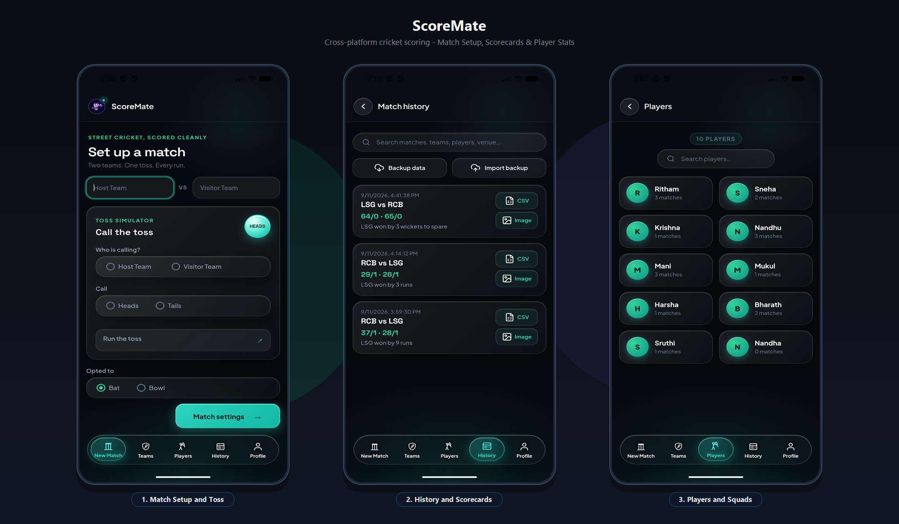

# ScoreMate

A cross-platform cricket scoring app for short and turf matches, built for Android, iOS and the web from a single codebase. Built through AI pair programming in Antigravity IDE. Ongoing project.



## Features

- **Match setup:** host and visitor teams, overs, toss and batting choice
- **Ball-by-ball scoring:** 0–6 runs, wides, no-balls, byes, leg-byes and wickets, with undo
- **Dismissals:** 12 types, including Bowled, Caught, LBW, Stumped, Run Out and Retired Hurt
- **Live stats:** score, wickets, overs, run rate, and batter and bowler figures
- **Teams and players:** team list with wins, losses and draws, plus a player list
- **Match history:** browse past matches
- **Export and backup:** CSV export, image export, and backup and import of your data

## Tech stack

- React 19 + TypeScript + Vite
- Capacitor 8 for Android and iOS
- Firebase Authentication (email, Google, Apple, phone) and Cloud Firestore for multi-device sync
- IndexedDB for offline-first local storage
- Recharts and jsPDF for charts and scorecard PDF export

## Getting started

```bash
npm install
npm run dev -- --host
```

Open the displayed address on your computer, or use your computer's local IP address from a phone on the same Wi-Fi network.

## Mobile builds

Generated native projects are in `android/` and `ios/`. Sync web changes to them with:

```bash
npm run mobile:sync
```

**Android:** install Android Studio and a JDK, set `JAVA_HOME`, then run `npm run android:build`. The debug APK is at `android/app/build/outputs/apk/debug/app-debug.apk`. Open the project in Android Studio with `npm run android:open`.

**iOS:** requires macOS with Xcode and CocoaPods. Run `npm run ios:open` or `npm run ios:build`, then sign the project with an Apple Developer team in Xcode.

## Support

If you find ScoreMate useful, you can sponsor development via [GitHub Sponsors](https://github.com/sponsors/nandhakrishnasr).