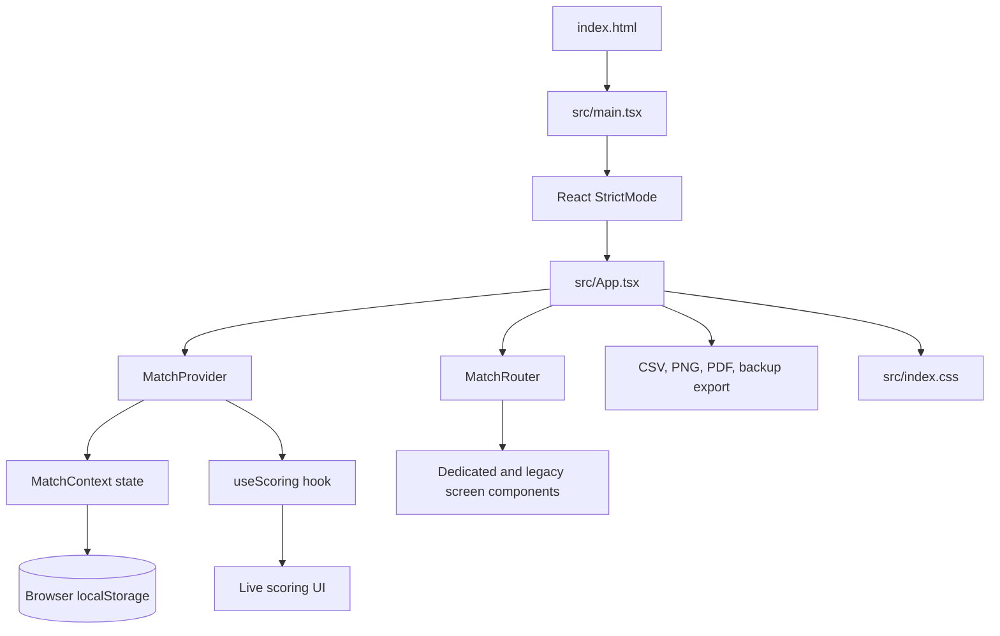
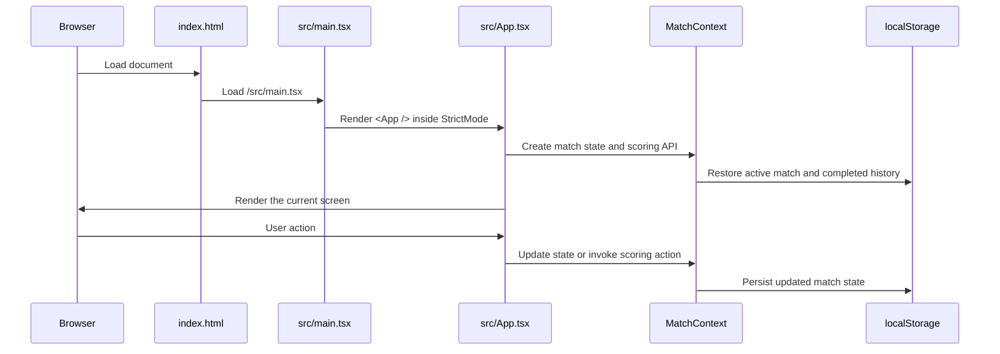
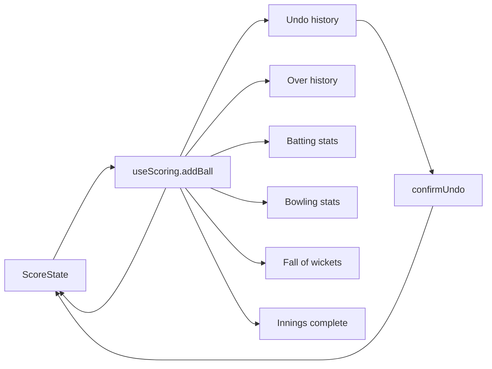
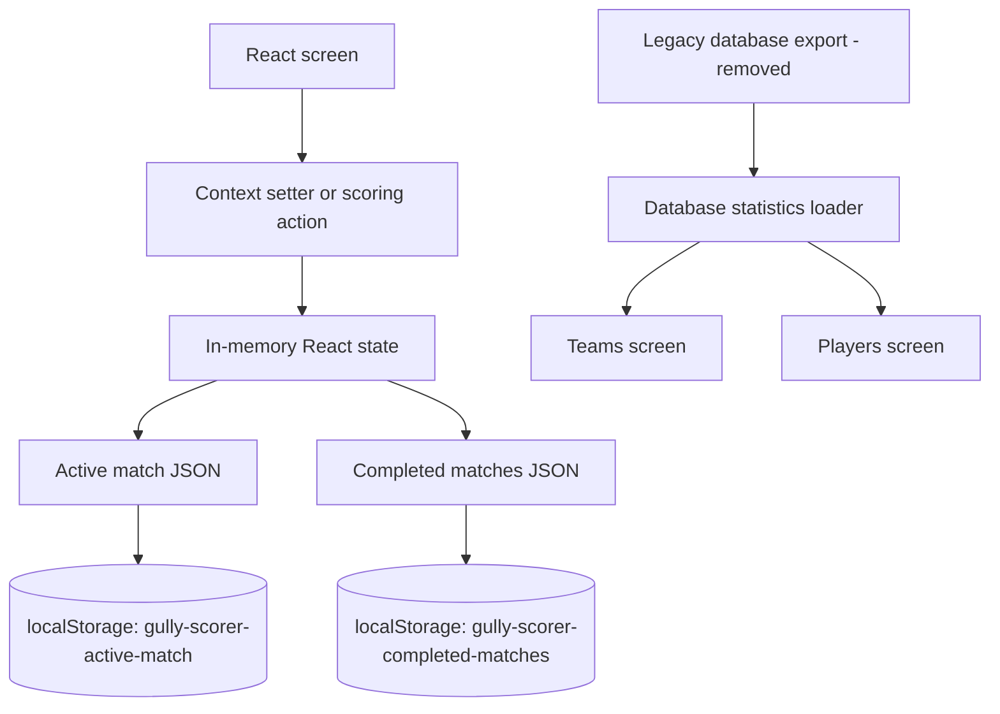

# Cricket Scorer Codebase Guide

This document explains the `cricket-scorer` project as it exists today. It is intended to answer two questions:

1. What does each important file and directory do?
2. Where should I edit the code when I want to change a feature?

The application is a mobile-first cricket scoring app. It runs as a React web application in Vite and can be packaged for Android and iOS with Capacitor.

## 1. Technology Stack

| Technology | Role | Where configured |
| --- | --- | --- |
| React 19 | Component UI, hooks, context, rendering | `src/`, `package.json` |
| TypeScript | Static typing for components, state, props, and domain models | `src/`, `tsconfig*.json` |
| Vite | Development server and production bundler | `vite.config.ts`, `package.json` |
| Capacitor 8 | Wraps the web build as Android and iOS applications | `capacitor.config.ts`, `android/`, `ios/` |
| Recharts | Innings charts on the result screen | `src/App.tsx` |
| jsPDF | Scorecard PDF export | `src/App.tsx` |
| Oxlint | JavaScript/TypeScript linting | `.oxlintrc.json`, `package.json` |
| CSS | Responsive mobile-first visual design | `src/index.css`, `src/App.css` |
| Browser localStorage | Active match, match history, theme, images, and demo auth persistence | `src/context/MatchContext.tsx`, `src/App.tsx` |

There is no backend service in this repository. Match data and statistics are stored in the browser (IndexedDB and localStorage) and synced to Cloud Firestore; new matches are not sent to an external legacy server.

## 2. Runtime Architecture

The application has four main layers:

- **Bootstrap layer:** mounts React into the HTML document.
- **Application shell:** coordinates theme, database statistics, scoring setup, and global overlays.
- **State and domain layer:** owns match state and scoring transitions.
- **Presentation layer:** renders setup, live scoring, scorecards, history, teams, players, and result screens.



## 3. Application Startup



## 4. Directory and File Map

### Root files

#### `index.html`

The Vite HTML entry document.

Responsibilities:

- Defines the browser document shell.
- Provides `<div id="root">` for React.
- Loads `/src/main.tsx` as the module entry point.
- Sets the document title and viewport metadata.

Edit this file for:

- Page title.
- Favicon or global metadata.
- Viewport or theme metadata.

Do not put application screens or scoring logic here.

#### `package.json`

Defines project metadata, scripts, and dependencies.

Important scripts:

```text
npm run dev -- --host   Start the Vite development server
npm run build           Type-check and create the production dist/ build
npm run lint            Run Oxlint
npm run preview         Serve the production build locally
npm run mobile:sync     Build the web app and copy it into Capacitor projects
npm run android:open    Sync and open Android Studio
npm run android:build   Sync and build a debug Android APK
npm run ios:open        Sync and open Xcode on macOS
npm run ios:build       Sync and build the iOS project on macOS
```

Add a dependency here through the package manager, not by manually editing generated native dependency files.

#### `vite.config.ts`

Vite configuration. It currently enables the official React plugin and otherwise uses Vite defaults.

Edit this file for:

- Vite plugins.
- Aliases.
- Build output settings.
- Development proxy rules.
- Code splitting or chunk size settings.

#### `capacitor.config.ts`

Connects the Vite web build to Capacitor.

Important values:

- `appId`: native application identifier, currently `com.gullyscorer.app`.
- `appName`: displayed native app name, currently `Gully Scorer`.
- `webDir`: folder copied into native projects, currently `dist`.

Edit this file for native app identity or Capacitor-level configuration.

#### `tsconfig.json`, `tsconfig.app.json`, `tsconfig.node.json`

TypeScript configuration split between application source and Node/Vite configuration.

- `tsconfig.app.json` controls React application files.
- `tsconfig.node.json` controls Vite and Node-side configuration.
- `tsconfig.json` references both projects.

If a build fails with a TypeScript error, inspect these files only after checking the source error itself.

#### `.oxlintrc.json`

Oxlint configuration. Use it to change lint rules or exclusions.

#### `README.md`

Short user-facing setup and packaging instructions. This guide is the detailed developer reference.

#### `gully-scorer-backup.json`

A local backup/export artifact. It is not source code. Do not use it as the canonical schema; the runtime backup import/export logic is in the React application.

#### `cricket-scorer-db`, `export_cricket_db.py`

Local database/export utilities and artifacts. The app consumes the resulting JSON export, not the database directly at runtime.

### `src/`

All editable React and TypeScript application source lives here.

```text
src/
  main.tsx
  App.tsx
  App.css
  index.css
  components/
  context/
  hooks/
  types/
  data/
  assets/
```

#### `src/main.tsx`

The React bootstrap file.

Current flow:

```tsx
createRoot(document.getElementById('root')!).render(
  <StrictMode>
    <App />
  </StrictMode>,
)
```

Edit this file for:

- Global providers that should wrap the whole app.
- React root setup.
- StrictMode configuration.
- Global startup instrumentation.

Do not add feature state here.

#### `src/App.tsx`

The current application shell and remaining orchestration module.

It currently contains:

- Global theme state and settings overlay.
- Database statistics loading (the legacy database export has been removed).
- Match setup callbacks such as toss handling, roster editing, and innings initialization.
- Match completion and result construction.
- Export helpers for CSV, PNG, backup JSON, and PDF.
- Some legacy inline screen components that have not yet been extracted.
- The route map passed to `MatchRouter`.
- Shared visual components such as `Header`, `BottomNav`, `Choice`, and scorecard helpers.

The active extracted screens are imported from:

- `src/components/screens/LoginScreen.tsx`
- `src/components/screens/SetupScreen.tsx`

The scoring state is provided through `MatchContext` and `useScoring`.

Edit `App.tsx` when:

- Adding a global overlay or app-wide service integration.
- Changing database-stat loading.
- Changing result construction or export orchestration.
- Wiring a newly extracted screen into the route map.

Avoid adding new match state here. Put persistent match state in `MatchContext` and scoring transitions in `useScoring`.

Important current cleanup note: `App.tsx` still contains duplicate domain type declarations and legacy inline implementations of login/setup and other screens. The extracted files are the active route targets, but the old inline implementations remain as migration leftovers. They can be deleted after their behavior is fully compared with the extracted versions.

#### `src/index.css`

Primary application stylesheet.

It contains:

- Font imports.
- Dark and light theme CSS variables.
- Global resets.
- Layout, buttons, forms, cards, navigation, modals, scorecards, and responsive rules.

Edit this file for visual changes. Search by the screen class first, for example:

```text
.login-shell
.setup-shell
.live-shell
.scorecard-screen
.history-screen
.teams-screen
.players-stats-screen
.result-screen
```

The current design uses `DM Sans` for normal text and `Space Grotesk` for selected display text. Theme colors are defined as CSS variables near the top of the file.

#### `src/App.css`

This is leftover Vite starter CSS containing selectors such as `.hero`, `#center`, and `#next-steps`. The active app imports `src/index.css`, not `App.css`. Treat this file as unused legacy starter styling unless the import strategy is changed.

#### `src/types/match.ts`

Shared cricket domain types.

Important types:

- `Player`: batter scorecard data.
- `SquadPlayer`: roster player data.
- `Delivery`: one ball display and legality record.
- `OverSummary`: completed-over summary.
- `ScoreState`: complete current innings state.
- `Screen`: allowed application routes/screens.
- `BallKind`, `ScoringModal`, `WicketType`, `WicketDetails`: scoring UI and domain unions.
- `MatchResult`, `CompletedMatch`: finished match data.
- `SavedAppState`: localStorage schema for active matches.
- `TeamStat`: team statistics shape.

Edit this file first when a new field is needed in match state. Then update:

1. The state owner in `MatchContext`.
2. The transition logic in `useScoring` if scoring changes it.
3. The screen that displays or edits it.
4. The saved-state validation and persistence shape.
5. Any export or aggregation code that consumes it.

#### `src/context/MatchContext.tsx`

The shared application state owner for match setup and persistence.

It provides:

- `MatchProvider`: React context provider.
- `useMatch`: access to `{ state, score, scoring }` from descendant components.
- `useMatchState`: creates and restores persistent match state.

State currently includes:

- Current screen.
- Team names, overs, team size, venue, competition.
- Toss caller, toss call, toss winner, and bat/bowl decision.
- Home and visitor rosters.
- Opening selections.
- Current score, undo history, innings information, and result.
- Completed match history.
- Authentication form state for the demo login flow.
- Setter functions for the above values.

Persistence keys:

- `gully-scorer-active-match`
- `gully-scorer-completed-matches`

Edit this file when:

- Adding a persistent match or auth field.
- Changing active-match restore behavior.
- Changing localStorage serialization.
- Making a screen read shared state directly instead of receiving a large prop bundle.

Do not put detailed ball-by-ball scoring rules here. Those belong in `useScoring`.

#### `src/hooks/useScoring.ts`

The scoring domain hook. This is the main owner of ball-level transitions.

It handles:

- Runs from 0 through 7.
- Wides, no-balls, byes, and leg-byes.
- Wickets and dismissal formatting.
- Legal-ball counting.
- Batter and bowler statistics.
- Strike rotation.
- Over completion and over history.
- Partnerships and fall of wickets.
- Free-hit state.
- Innings completion.
- Next-batter and next-bowler selection state.
- Undo confirmation and restoration.
- Wicket helper selection.
- Live score image generation callback.

The hook receives the current score and setter functions through `UseScoringOptions`. It reports innings completion back to `App` through callbacks.

Edit this file when:

- Changing what a delivery does to score, wickets, balls, extras, strike, or statistics.
- Adding a scoring event such as penalty runs.
- Changing innings completion rules.
- Changing undo behavior.

A scoring change should be validated with a focused scoring test or at least a production build plus manual live-match flow.

#### `src/components/MatchRouter.tsx`

Small route selection component. It receives:

- `screen`: the current `Screen` union value.
- `routes`: a map from screen names to React nodes.
- `fallback`: the live-screen node used when no explicit route matches.

It is not a browser router. It is an in-memory screen switch for the mobile app flow.

Edit this file only if route selection behavior changes. Add screen implementations in `src/components/screens/` and register them in `App.tsx`.

#### `src/components/Icon.tsx`

Shared image-based icon component.

It maps an icon name to a PNG under `/public/icons/` and selects either the `128` or `256` asset based on requested size.

Example:

```tsx
<Icon name="settings" variant="white" size={24} label="Open settings" />
```

When adding an icon:

1. Add the matching asset under `public/icons/purple/128`, `public/icons/purple/256`, `public/icons/white/128`, and `public/icons/white/256` as appropriate.
2. Use the exact filename without the `.png` extension in the `name` prop.
3. Provide `label` for meaningful buttons so the image has accessible text.

#### `src/components/screens/LoginScreen.tsx`

Active login/auth screen.

Uses `useMatch()` to read and update auth form state from `MatchContext`.

Supports the current demo flows:

- Email/password sign in using localStorage.
- Demo phone OTP using `123456`.
- Demo account creation.
- Demo Google and Apple continuation.
- Guest continuation.

This is demo authentication, not production authentication. Passwords are stored in browser localStorage and should not be treated as secure.

Edit this file for:

- Login form layout.
- Auth validation messages.
- Auth provider buttons.
- The demo auth flow.

For real authentication, replace the localStorage logic with a backend or identity provider and avoid storing passwords in the browser.

#### `src/components/screens/SetupScreen.tsx`

Active first setup screen.

Collects:

- Host and visitor team names.
- Toss caller and heads/tails call.
- Toss result display.
- Bat/bowl decision.
- Navigation to match settings.

It receives setup values and callbacks as props. Persistent values are owned by `MatchContext`; the screen is a presentation and interaction layer.

Edit this file for:

- Team setup fields.
- Toss UI.
- Setup copy and layout.
- Navigation from the initial setup screen.

#### Remaining screen components in `src/App.tsx`

The following screens currently still live in the large App module and are candidates for the next extraction pass:

- `MatchOptionsScreen`: overs, team size, last-man-batting, venue, and competition.
- `PlayersScreen`: home and visitor roster editing.
- `OpeningSelectScreen`: first-innings opening batters and bowler.
- `InningsBreakScreen`: first innings summary and chase transition.
- `SecondOpeningScreen`: second-innings opening selections.
- `LiveScreen`: active scoreboard and scoring controls. It already consumes scoring actions through `MatchContext`.
- `ScorecardScreen`: current and previous innings scorecards.
- `ResultScreen`: match result, player of the match, charts, and PDF export.
- `HistoryScreen`: completed match list, backup import/export, CSV and image export.
- `TeamsScreen`: team aggregate statistics and team image management.
- `PlayersStatsScreen`: player aggregate statistics and player image management.

Recommended extraction order:

1. `MatchOptionsScreen`, `PlayersScreen`, and opening-selection screens.
2. `LiveScreen`, after its current context-backed scoring API is kept stable.
3. `HistoryScreen`, `TeamsScreen`, and `PlayersStatsScreen`.
4. `ResultScreen` and scorecard components.
5. Delete duplicate inline implementations and duplicate types from `App.tsx`.

#### `src/assets/`

Source assets that are imported by TypeScript or React modules. Runtime public URLs such as icons are stored under `public/` instead.

### `public/`

Static files copied directly to the Vite build output.

#### Legacy Database Export

The legacy static database export has been removed from the repository.

#### `public/icons/`

Purple and white PNG icon assets in 128px and 256px variants. `Icon.tsx` resolves these files at runtime.

### `android/`

Generated and native Android project created by Capacitor.

Important areas:

- `android/app/`: Android application module.
- `android/app/src/main/`: Android manifest, resources, and packaged web assets.
- `android/app/build.gradle`: Android module build settings.
- `android/build.gradle`: root Android build configuration.
- `android/gradlew.bat`: Gradle wrapper for Windows builds.
- `android/app/build/`: generated build output; do not hand-edit.

Normal Android workflow:

```text
npm run android:build
```

Edit native Android files only for native-specific behavior such as permissions, activities, icons, or Gradle settings. After changing web code, run `npm run mobile:sync` so the updated `dist/` is copied into the native project.

### `ios/`

Generated and native iOS project created by Capacitor.

Important areas:

- `ios/App/App/`: native iOS wrapper and packaged web resources.
- `ios/App/App.xcodeproj/`: Xcode project.
- `ios/App/CapApp-SPM/`: Capacitor package integration.
- `ios/capacitor-cordova-ios-plugins/`: generated plugin support.

iOS builds require macOS and Xcode. Web changes must be synchronized with `npm run mobile:sync` before opening or building in Xcode.

### `com_kdm_scorer/`

Extracted or archived data from the older KDM scorer application. It is not part of the active React runtime path.

### `tools/`

Data conversion and debugging utilities:

- `convert_kdm_backup.py`: converts older backup data.
- `debug_kdm_batting.py`: helps inspect batting data.
- `export_kdm_history.py`: exports historical match data.
- `README.md`: utility-specific instructions.

These are offline developer tools, not part of the browser bundle.

## 5. Match State Model

```mermaid
stateDiagram-v2
    [*] --> login
    login --> setup: sign in / OTP / guest
    setup --> match-options: valid team names
    match-options --> roster: valid match rules
    roster --> opening-select: squads ready
    opening-select --> live: opening lineup selected
    live --> scorecard: open scorecard
    live --> innings-break: first innings complete
    innings-break --> second-opening: set up chase
    second-opening --> live: second opening lineup selected
    live --> result: second innings complete
    result --> setup: new match
    setup --> teams: bottom navigation
    setup --> players: bottom navigation
    setup --> history: bottom navigation
    history --> live: resume active match
```

### Main `ScoreState` flow



## 6. Where to Edit Common Features

### Add a new scoring button or delivery type

Edit:

1. `src/types/match.ts`: add or update `BallKind`.
2. `src/hooks/useScoring.ts`: define legality, runs, statistics, labels, and completion behavior.
3. `LiveScreen` in `src/App.tsx` for the button or modal UI, until that screen is extracted.
4. `src/index.css` for layout or styling.

Also check:

- `ScoreState.currentOver` display.
- CSV/PDF/image exports.
- Player and team aggregate calculations.

### Change the scoring rules

Start in `src/hooks/useScoring.ts`. Do not change only the UI button. The hook decides:

- Legal versus illegal deliveries.
- Batter runs and extras.
- Bowler conceded runs.
- Wickets and dismissals.
- Strike rotation.
- Over completion.
- Innings completion.

### Add a match setup field

Edit:

1. `src/types/match.ts`: add it to `SavedAppState` if persisted.
2. `MatchContext.tsx`: add state, setter, restore logic, and serialization.
3. The relevant screen props and UI.
4. `App.tsx` only where the field affects match initialization or result behavior.

### Change login/authentication

Edit `src/components/screens/LoginScreen.tsx` for the screen and `src/context/MatchContext.tsx` for form state. For production authentication, introduce a real service boundary instead of extending the current localStorage demo.

### Change history, backup, or export

Current logic is still mostly in `src/App.tsx` and `HistoryScreen`:

- Backup JSON: active match plus completed matches.
- CSV: player batting rows.
- PNG: canvas-generated scorecard image.
- PDF: `jsPDF` result scorecard.

When extracting these features, prefer a service module such as `src/services/exports.ts` so screen components only call named functions.

### Change team or player statistics

Database-backed statistics were originally loaded from a static database export (the legacy database export has been removed). Local completed-match aggregates are calculated by helper functions in the same file.

A future cleanup should move these into:

```text
src/services/databaseStats.ts
src/services/matchStats.ts
```

### Change colors, typography, or responsive layout

Start in `src/index.css`:

- Global variables are at the top.
- Dark theme is the default.
- Light theme uses `:root[data-theme='light']`.
- Screen-specific selectors are grouped throughout the file.

Theme selection is stored under `gully-scorer-theme` by the settings logic in `App.tsx`.

### Add a new screen

1. Add the screen name to `Screen` in `src/types/match.ts`.
2. Create `src/components/screens/NewScreen.tsx`.
3. Use `useMatch()` for shared state rather than adding another prop chain.
4. Register the screen in the `routes` map in `App.tsx`.
5. Add navigation to it from the appropriate screen.
6. Add CSS under a dedicated screen class.
7. Run `npm run build` and `npm run lint`.

## 7. Persistence and Data Boundaries



The active match is serialized as `SavedAppState`. Completed matches are serialized separately. Browser localStorage is device/browser-local, so clearing site data removes these records unless the user exports a backup.

## 8. Export and Import Boundaries

| Feature | Implementation | Output |
| --- | --- | --- |
| Active match persistence | `MatchContext` | localStorage JSON |
| Completed history persistence | `MatchContext` | localStorage JSON |
| Backup export/import | Settings and history code in `App.tsx` | JSON file |
| Match CSV | `exportMatchCsv` | CSV download |
| Match image | `exportMatchImage` | PNG download |
| Live update image | `createLiveScoreImage` and `useScoring` callback | PNG/share payload |
| Result PDF | `ResultScreen` and `jsPDF` | PDF download |

## 9. Development Workflow

### Browser development

```powershell
cd scoreMate-app
npm install
npm run dev -- --host
```

Use the Vite URL shown in the terminal. `--host` allows testing from another device on the same network.

### Validate a change

```powershell
npm run build
npm run lint
```

`npm run build` runs TypeScript project compilation before Vite bundling. It is the primary check for broken imports, invalid props, and type errors.

### Android

```powershell
npm run android:build
```

This runs a web build, Capacitor sync, and Gradle debug APK build. The output APK is normally:

```text
android/app/build/outputs/apk/debug/app-debug.apk
```

### iOS

Run on macOS:

```bash
npm run ios:open
npm run ios:build
```

The iOS project must be signed in Xcode before installing on a device or distributing it.

## 10. Current Architectural Debt and Recommended Next Steps

The refactor is in progress. The most important remaining cleanup items are:

1. Remove duplicate domain types from `App.tsx` and import them from `src/types/match.ts`.
2. Delete the now-unused inline `LoginScreen` and `SetupScreen` implementations after behavior comparison.
3. Extract the remaining screens from `App.tsx` into `src/components/screens/`.
4. Move export functions into `src/services/exports.ts`.
5. Move database and local aggregate statistics into dedicated services.
6. Split `MatchContext.tsx` into a provider file and a state/persistence hook if Fast Refresh warnings matter.
7. Add unit tests for `useScoring`, especially wides, no-balls, wickets, strike rotation, over completion, last-man-batting, target completion, and undo.
8. Add a schema version to saved localStorage state before making incompatible changes.
9. Avoid storing real passwords in localStorage; replace the demo auth with an identity provider before production use.
10. Keep generated `dist/`, Android build output, and iOS packaged web assets out of manual edits.

## 11. Practical Decision Guide

| If you want to change... | Start here |
| --- | --- |
| Score calculation | `src/hooks/useScoring.ts` |
| Shared match fields | `src/context/MatchContext.tsx` and `src/types/match.ts` |
| Login UI | `src/components/screens/LoginScreen.tsx` |
| Initial setup UI | `src/components/screens/SetupScreen.tsx` |
| Live scoring UI | `LiveScreen` in `src/App.tsx` until extracted |
| Match history UI | `HistoryScreen` in `src/App.tsx` until extracted |
| Team/player stats | Stats helpers and screens in `src/App.tsx` |
| Screen navigation | `src/components/MatchRouter.tsx` and the route map in `src/App.tsx` |
| Colors/layout | `src/index.css` |
| Icons | `src/components/Icon.tsx` and `public/icons/` |
| Browser database snapshot | Legacy database export (removed) |
| Android native behavior | `android/` native source and Gradle files |
| iOS native behavior | `ios/` Xcode project and native source |
| Build commands | `package.json` |

## 12. Important Security and Product Notes

- Authentication is a local demo. It is not secure authentication.
- Match data is local to the browser or packaged app webview.
- The legacy database export has been removed; client statistics are computed from local storage and bundled history.
- Generated native directories should be changed carefully because Capacitor can overwrite web assets during sync.
- The app currently has no server-side conflict resolution or multi-device synchronization.
