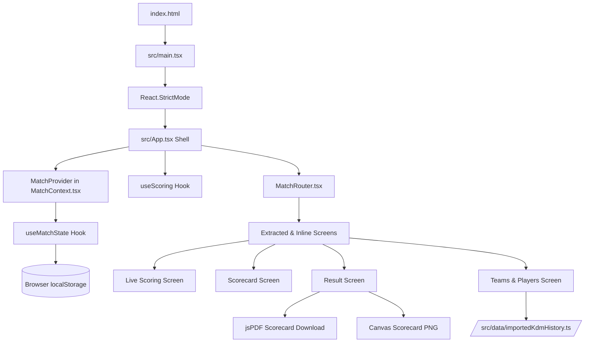
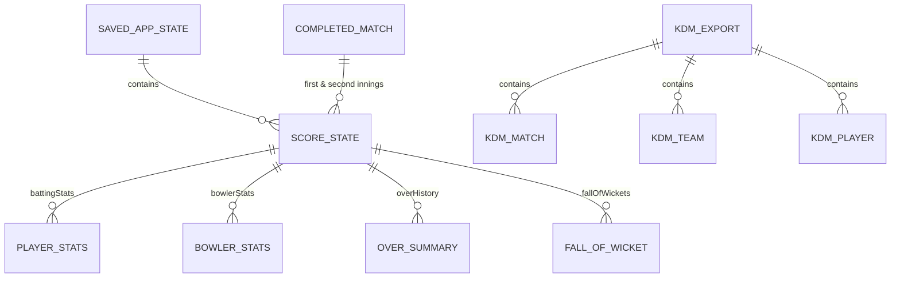

# ScoreMate (Gully Scorer) - Comprehensive Codebase Analysis

**Date:** September 14, 2026  
**Status:** Approximately 60% Complete  
**Application Identity:** "ScoreMate" (referred to in code and assets as "Gully Scorer" / `com.gullyscorer.app`)  

---

## Executive Summary

ScoreMate is a mobile-first, client-side cricket scoring application designed for short matches and street/gully cricket. Built with React 19, TypeScript, and Vite, it is wrapped with Capacitor 8 for cross-platform Android and iOS deployment. The application currently supports match creation, coin toss simulation, squad management, ball-by-ball scoring, dismissal tracking, innings transitions, PDF/CSV/image scorecard exports, and career statistics aggregation from an exported historical database.

While core scoring and UI flows are functional (~60% complete), the codebase contains significant architectural debt—most notably a 1,300-line monolithic container (`App.tsx`), duplicate scoring functions, missing cricket rule edge cases, and local storage state resets.

---

## 1. Complete Technology Stack

| Layer | Technologies / Libraries | Version / Details | Purpose |
|---|---|---|---|
| **Core UI Framework** | [React](package.json) / [React-DOM](package.json) | `^19.2.8` | Component rendering, hooks, state, context |
| **Language** | [TypeScript](package.json) | `~6.0.2` | Static typing, interface contracts, domain models |
| **Build & Dev Server** | [Vite](package.json) + [@vitejs/plugin-react](package.json) | `^8.2.2` / `^6.1.0` | Fast HMR dev server and production Rollup bundler |
| **Mobile Runtime** | [Capacitor Core](package.json), [Android](package.json), [iOS](package.json), [CLI](package.json) | `^8.5.1` | Native Android (`android/`) and iOS (`ios/`) wrappers |
| **Styling & Design System** | Vanilla CSS ([`src/index.css`](src/index.css)) | Custom CSS3 (~65 KB) | Glassmorphism, CSS custom properties (dark/light), Google Fonts (DM Sans, Space Grotesk), mobile shell container |
| **Data Visualization** | [Recharts](package.json) | `^3.10.1` | Manhattan (runs per over) and Worm (cumulative runs) LineCharts |
| **Document Generation** | [jsPDF](package.json) | `^4.2.1` | Client-side vector match scorecard PDF creation |
| **Graphics & Social Share** | HTML5 Canvas 2D API & Web Share API | Browser Native | Scorecard PNG rendering & live over update image sharing |
| **Linter** | [Oxlint](package.json) | `^1.79.0` | Rust-based high-performance JavaScript/TypeScript linter |
| **Persistence** | Web Storage API (`localStorage`) | Browser Native | Active match, completed matches, theme, custom logos/photos, auth cache |
| **Data Conversion Tools** | Python 3 + SQLite / SQLCipher scripts | Python 3.10+ | Extraction from legacy Android database (`com.kdm.scorer`) into JSON |

---

## 2. Project Architecture

The application adopts a **single-page mobile shell architecture** constrained to a mobile viewport (`.app-canvas`, max-width 480px) that renders inside native WebViews on iOS/Android or desktop browsers.



### Architectural Characteristics:
- **Screen-Based State Routing:** No URL routing (no `react-router-dom`). A state enum `Screen` (`'login' | 'setup' | 'opening' | 'match-options' | 'roster' | 'opening-select' | 'innings-break' | 'second-opening' | 'live' | 'scorecard' | 'result' | 'history' | 'teams' | 'players'`) controls which screen component is rendered via [MatchRouter.tsx](src/components/MatchRouter.tsx).
- **Two-Way State Bridge:** Match initialization and persistence are managed by [MatchContext.tsx](src/context/MatchContext.tsx), while delivery-by-delivery state mutation is isolated in [useScoring.ts](src/hooks/useScoring.ts).
- **Zero-Backend Client-Only Model:** Match histories and settings are written directly to `localStorage`. Team and player historical aggregates were originally hydrated on boot by fetching a static JSON file (the legacy database export has been removed; history is bundled in `src/data/importedKdmHistory.ts`).

---

## 3. Folder Structure & Purpose of Major Modules

```
cricket-scorer/
├── android/                         # Generated native Android Capacitor project (Gradle, Java/Kotlin)
├── ios/                             # Generated native iOS Capacitor project (Xcode, CocoaPods/SPM)
├── public/                          # Static assets copied directly to build output
│   ├── (legacy database export removed)
│   ├── icons/                       # PNG icon assets (purple/white, 128px and 256px resolutions)
│   ├── favicon.svg & icons.svg      # Favicon and vector sprite
├── src/                             # Application source code
│   ├── assets/                      # Imported local assets
│   ├── components/                  # React UI components
│   │   ├── Icon.tsx                 # Dynamic asset-backed PNG icon renderer
│   │   ├── MatchRouter.tsx          # Key-based screen switcher
│   │   └── screens/                 # Modularized screen components
│   │       ├── LoginScreen.tsx      # Demo authentication & guest access screen
│   │       └── SetupScreen.tsx      # Host/Visitor setup, coin toss simulator
│   ├── context/
│   │   └── MatchContext.tsx         # Global React context, match persistence, state provider
│   ├── data/
│   │   └── importedKdmHistory.ts    # 3.2 MB unreferenced legacy match history export
│   ├── hooks/
│   │   └── useScoring.ts            # Core cricket scoring engine & state transition hook
│   ├── types/
│   │   └── match.ts                 # Domain type definitions (Player, ScoreState, Delivery, etc.)
│   ├── App.css                      # Unused starter CSS from Vite template
│   ├── App.tsx                      # 1300-line monolithic shell, inline screens, exports, stats loaders
│   ├── index.css                    # Comprehensive design system stylesheet (~65 KB)
│   └── main.tsx                     # React DOM entry point
├── tools/                           # Offline developer Python conversion scripts
│   ├── convert_kdm_backup.py        # Converts KDM JSON export to Gully Scorer backup JSON
│   ├── debug_kdm_batting.py         # Debugging script for batting stats
│   ├── export_kdm_history.py        # Historical match export script
│   └── README.md                    # Data conversion documentation
├── capacitor.config.ts              # Capacitor native runtime configuration
├── export_cricket_db.py             # SQLCipher database decrypter and JSON exporter
├── package.json                     # NPM packages, build scripts, Capacitor dependencies
└── vite.config.ts                   # Vite bundler configuration with React plugin
```

---

## 4. State Management Approach

State management relies on React's built-in Context API without external libraries (no Redux, Zustand, or TanStack Query):

1. **`MatchContext` (`src/context/MatchContext.tsx`):**
   - Holds match setup properties (`teamOne`, `teamTwo`, `overs`, `teamSize`, `lastManBatting`, `venue`, `competition`, toss details).
   - Holds active rosters (`homePlayers`, `visitorPlayers`, `battingRoster`, `bowlingRoster`).
   - Holds score instances: `score` (`ScoreState`), `firstInningsScore`, `history` (`ScoreState[]` for undo).
   - Holds completed matches history (`completedMatches: CompletedMatch[]`).
   - Holds demo authentication input states (`authEmail`, `authPhone`, `authOtp`, etc.).
2. **`useScoring` Hook (`src/hooks/useScoring.ts`):**
   - Subscribes to the active `ScoreState` from `MatchContext`.
   - Maintains delivery modal state (`scoringModal`: wide, no-ball, bye, leg-bye, wicket).
   - Maintains selection dialog states (`nextBatterOpen`, `nextBowlerOpen`, `wicketDetails`, `undoPending`).
   - Emits state updates through `setScore` and `setHistory`.
3. **Synchronization & Persistence Strategy:**
   - **Load on Mount:** On initial render, a `useEffect` reads `localStorage.getItem('gully-scorer-active-match')` and `gully-scorer-completed-matches`.
   - **Auto-Sync:** A secondary `useEffect` runs whenever any state field updates, serializing the entire `SavedAppState` and `CompletedMatch[]` to `localStorage`.
   - **Undo Buffer:** Each delivery creates a full deep clone via `structuredClone(score)` pushed into `history`. Clicking **Undo** pops the last snapshot and replaces the active `score`.

---

## 5. Database Architecture

There is no client-server database. Instead, the application combines **browser local storage** with an **ingested static relational JSON database**:



### 1. Browser LocalStorage Collections
- `gully-scorer-active-match`: Active match configuration, current score, rosters, undo stack.
- `gully-scorer-completed-matches`: Array of completed match scorecards.
- `gully-scorer-team-images`: Key-value map of Team Name -> Base64 Data URL.
- `gully-scorer-player-images`: Key-value map of Player Name -> Base64 Data URL.
- `gully-scorer-theme`: `'dark'` | `'light'`.
- `gully-scorer-auth`: Demo credentials `{ email, password }`.

### 2. Static Relational Database (Legacy export - removed)
- Derived from the SQLCipher-encrypted SQLite database of the earlier native app (`com.kdm.scorer`).
- The legacy static database export has been removed; historical match data is now bundled in `src/data/importedKdmHistory.ts`.
- Ingested on app launch inside `App.tsx` via `loadTeamStatsFromDatabase()` and `loadPlayerStatsFromDatabase()`, computing career aggregates on the client.

---

## 6. API Integrations

**There are NO external web services or remote APIs connected.**
- **No REST/GraphQL Backend:** No server to store users, matches, or live games.
- **No Live Cricket API:** No feeds from CricAPI, ESPNcricinfo, or Sportradar.
- **Client-Side Web Platform APIs Utilized:**
  1. Legacy database export loading: Asynchronous local static asset loading (the legacy database export has been removed).
  2. `localStorage`: Synchronous browser storage.
  3. `navigator.share()` / `navigator.canShare()`: Native OS share sheet for sharing generated over summaries.
  4. `HTMLCanvasElement.toDataURL('image/png')`: Dynamically paints scorecards and live over cards onto an offscreen 1200x630 canvas for PNG download.
  5. `URL.createObjectURL(new Blob(...))`: Generates downloads for CSV scorecards and JSON backup dumps.

---

## 7. Completed Features

1. **Match Setup & Configuration:**
   - Host and Visitor team selection.
   - Animated 3D/CSS coin toss simulator with caller selection, heads/tails choice, and bat/bowl decision.
   - Match configuration: Overs slider (1–50 overs), team squad size (2–25 players), venue, competition/tournament name.
   - Last Man Batting rule toggle.
   - Squad builder allowing addition, editing, and removal of players with batting hand (Right/Left).
   - Lineup selection for Opening Striker, Non-Striker, and Opening Bowler.
2. **Live Match Scoring:**
   - Standard runs: Dot (0), 1, 2, 3, 4, 6 and running 5, 7.
   - Extras modal: Wides (WD + 0–6), No Balls (NB + 0–6), Byes (B + 0–6), Leg Byes (LB + 0–6).
   - Wicket modal with 12 dismissal types: Bowled, Caught, Caught Behind, Caught & Bowled, Run Out, LBW, Stumped, Retired Hurt, Mankaded, Hit Wicket, Absent, Retired Out.
   - Fielder selector sheet for catches, stumpings, and run out helpers.
   - Current over ball badge history (`0`, `4`, `W`, `WD`, `NB`, etc.).
   - Over completion detection (every 6 legal balls) with automatic over archiving and prompt for next bowler.
   - Fall of Wickets (FOW) timeline tracking wicket number, score, batter, and dismissal string.
   - Partnership counter tracking active partnership runs and balls.
   - Dynamic CRR (Current Run Rate) and RRR (Required Run Rate) calculation.
   - Strike rotation on odd runs, end of over, and manual "Swap Batters" button.
   - Single-step and multi-step Undo delivery with confirmation modal.
   - Milestone banner alerts (toasts for 50s, 100s, 5-wicket hauls, hat-tricks).
3. **Innings Transition & Chase:**
   - Innings break screen displaying target (`firstInningsRuns + 1`), overs bowled, and required rate.
   - Chase lineup selector (opening batters and opening bowler for 2nd innings).
   - Target reached / innings complete automatic match termination.
4. **Post-Match & Analytics:**
   - Winner calculation (by runs, by wickets, or Match Drawn/Tied).
   - Player of the Match auto-recommendation algorithm (`runs + wickets * 20`) with manual override dropdown.
   - Innings analytics charts using Recharts: Manhattan chart (runs per over) and Worm chart (cumulative chase comparison).
5. **Exports & Offline Backups:**
   - PDF Scorecard download via `jsPDF`.
   - CSV Scorecard export for spreadsheet analysis.
   - Match summary scorecard PNG canvas export.
   - Live over snapshot image export with Web Share API.
   - Full app JSON backup export and import.
6. **Career & Team Profiles:**
   - Teams directory with win/loss/draw records, head-to-head opponent filters, and custom team logo upload.
   - Players directory with Batting, Bowling, and Fielding tabs, career averages, strike rates, economy, and custom profile photo upload.
   - Dark and Light theme switcher persisted to localStorage.

---

## 8. Partially Completed Features

1. **Code Modularization:**
   - Only `LoginScreen.tsx` and `SetupScreen.tsx` are extracted into standalone components.
   - Nine screens (`MatchOptionsScreen`, `PlayersScreen`, `OpeningSelectScreen`, `InningsBreakScreen`, `SecondOpeningScreen`, `LiveScreen`, `ScorecardScreen`, `ResultScreen`, `HistoryScreen`, `TeamsScreen`, `PlayersStatsScreen`) remain defined inline in `src/App.tsx`.
   - Domain types are duplicated both in `src/types/match.ts` and inline in `src/App.tsx`.
   - A redundant `addBall` function (~100 lines) exists in `src/App.tsx` alongside `src/hooks/useScoring.ts`.
2. **Authentication Flow:**
   - Purely simulated demo. Passwords are stored in plaintext in `localStorage`.
   - Phone OTP is hardcoded to `'123456'`.
   - Social login buttons merely check for an email string without OAuth handshakes.
   - The app resets `screen` to `'login'` on every browser reload, forcing users to click through login/guest mode even when resuming an active game.
3. **Historical Data vs Local Matches Integration:**
   - Career stats calculation parses the 50 MB static JSON on boot.
   - However, local completed matches and database historical matches are not merged consistently: in `TeamsScreen`, database stats completely override local matches if the JSON is present; in `PlayersStatsScreen`, local matches override database stats.
   - `src/data/importedKdmHistory.ts` (3.2 MB) is present in the repository but completely unreferenced.
4. **Last Man Batting:**
   - Clears non-striker and lets striker bat alone, but odd run strike rotation still occurs when non-striker is absent, causing blank batter references.
5. **Bowler Spell Tracking:**
   - Re-introducing a bowler who bowled earlier in the innings does not aggregate their figures; it wipes their current spell back to 0/0 and adds duplicate records in `bowlerStats`.

---

## 9. Missing Features

1. **Backend & Cloud Services:**
   - No user accounts, cloud database, or server synchronization.
   - No real-time live match sharing or remote spectator view URL.
2. **Advanced Cricket Scoring Rules:**
   - **Overthrows:** No mechanism to record overthrows (extra runs from fielder misses during a run or boundary).
   - **Split No-Ball Runs:** Inability to record runs off the bat separately from the 1-run No Ball extra penalty.
   - **Penalty Runs:** No support for 5 penalty runs (e.g., ball hitting helmet behind keeper, ball tampering, unfair play).
   - **Non-Striker Run Out:** No option to indicate that the non-striker was run out; only the striker is dismissed.
   - **Free Hit Dismissal Constraints:** Bowled, Caught, LBW, and Stumped are not disabled on a Free Hit.
   - **Bowler Over Limits:** No enforcement of maximum overs per bowler (e.g., 4 overs in a 20-over match).
   - **Consecutive Over Blocking:** Bowlers can be erroneously selected to bowl two consecutive overs from both ends.
   - **Rain Rules / Target Adjustments:** No Duckworth-Lewis-Stern (DLS) or VJD method calculations for interrupted matches.
   - **Super Over / Tie Breaker:** No handling for Super Overs in tied limited-overs games.
3. **Match Experience & Tools:**
   - Wagon wheel / shot location / pitch zone heatmaps.
   - Ball-by-ball commentary or custom umpire notes.
   - Tournament / League bracket system with Net Run Rate (NRR) calculation.
   - Offline Progressive Web App (PWA) service worker (no offline asset caching).
   - Automated unit test suite (no Vitest or Jest tests for scoring logic).

---

## 10. Potential Bugs & Technical Debt

### Critical Bugs:
1. **App Reload Resets to Login Screen:**
   - In [MatchContext.tsx (line 160)](src/context/MatchContext.tsx), during state hydration from `localStorage`, it executes:
     ```ts
     setScreen('login')
     ```
     Refreshing the page during a live match drops the user out of the active scoring interface back to the login screen.
2. **Bowler Spell Reset Bug:**
   - In [useScoring.ts (line 91)](src/hooks/useScoring.ts):
     ```ts
     function chooseNextBowler(name: string) {
       options.setScore({
         ...options.score,
         bowler: { name, balls: 0, runs: 0, wickets: 0 },
         bowlerStats: [...options.score.bowlerStats, { name, balls: 0, runs: 0, wickets: 0 }]
       })
     }
     ```
     When a bowler returns for their 2nd or 3rd over, their previous balls, runs, and wickets are overwritten and a duplicate bowler row is appended to `bowlerStats`.
3. **Odd Runs on Final Ball of Over Strike Swap Bug:**
   - In [useScoring.ts (line 68)](src/hooks/useScoring.ts):
     ```ts
     const overComplete = isLegal && updated.balls % 6 === 0
     if ((kind === 'runs' && value % 2 === 1 || overComplete) && updated.nonStriker.name)
       updated = { ...updated, striker: updated.nonStriker, nonStriker: updated.striker }
     ```
     Because this uses a logical `||` (OR), if a single (1 run) is hit on ball 6, the expression evaluates to `true` once and only swaps batters once. In actual cricket, a single rotates strike (Swap 1), and then the end of over changes ends (Swap 2), netting **zero strike change**. The current code leaves the batter who took the single at the non-striker end.
4. **50 MB Synchronous JSON Fetch in Mobile WebView:**
   - In [App.tsx (lines 548–602, 604–716)](src/App.tsx), the legacy database export was previously fetched and parsed into memory (this legacy export has been removed).

### Technical Debt & Code Smells:
- **Massive Monolithic File:** `src/App.tsx` is 1,300 lines long and contains 9 unextracted screen components, PDF export logic, CSV generation, canvas drawing, and stats computation.
- **Dead Code in Repository:**
  - `src/data/importedKdmHistory.ts` is 3.2 MB and 151,925 lines long, but is never imported anywhere in `src/`.
  - `src/App.css` is an unused Vite template leftover.
  - `src/App.tsx` has lines 357–460 containing a copy of `addBall` that is superseded by `useScoring.ts`.
- **Oxlint Fast Refresh & Hook Warnings:**
  - `MatchContext.tsx` exports `useMatch` and `useMatchState` from the same file as `MatchProvider`, triggering React Fast Refresh warnings.
  - Synchronous `setState` calls inside hydration `useEffect` hooks trigger React cascading render warnings.
- **Large Bundle Size:** Vite build warns that `dist/assets/index--q13upr8.js` exceeds 1,033 kB (minified). No code splitting or dynamic imports are implemented.

---

## 11. Cricket Scoring Logic Currently Implemented

### Delivery Processing (`useScoring.ts`):
- **Legal Delivery:** Increments `score.balls` by 1; increments `striker.balls` and `bowler.balls` by 1.
- **Runs Scored:** Adds to team `runs`, `striker.runs`, and `bowler.runs`. Increments `fours` if `value === 4` and `sixes` if `value === 6`.
- **Extras Handled:**
  - **Wide:** Team runs += (1 + extras), bowler runs += (1 + extras). Does not count as a legal ball. Strike remains unchanged.
  - **No Ball:** Team runs += (1 + extras), bowler runs += (1 + extras). Does not count as a legal ball. Activates `freeHit = true`.
  - **Byes / Leg Byes:** Team runs += extras. Counts as a legal ball. Striker does not receive runs.
- **Over Completion:**
  - Triggers when `legalBalls % 6 === 0`.
  - Aggregates deliveries into `OverSummary` and appends to `overHistory`.
  - Clears `currentOver` array.
  - Swaps striker and non-striker.
  - Prompts `nextBowlerOpen = true` (unless innings finished or wicket fell on ball 6).
- **Dismissals:**
  - Appends to `fallOfWickets` (`wicket`, `score`, `batter`, `dismissal`).
  - Sets `striker.out = true` and updates `dismissal` text.
  - Resets partnership tracker to 0 runs and 0 balls.
  - Opens `nextBatterOpen = true`.
- **Innings Completion:**
  - Condition: `wickets >= wicketLimit || balls >= maxBalls || (innings === 2 && runs >= target)`.
  - Wicket limit: `battingRoster.length - 1` (or `battingRoster.length` if Last Man Batting).

---

## 12. Areas Where Cricket Rules May Be Incorrectly Implemented

| Rule Issue | Current Implementation | Official Cricket Rule (MCC Laws / ICC) |
|---|---|---|
| **1. Byes & Leg Byes Charged to Bowler** | [useScoring.ts:54](src/hooks/useScoring.ts): `nextBowler.runs += batterRuns + extras` includes Byes & Leg Byes | **MCC Law 21 & 23:** Byes and Leg Byes are conceded by the fielding side as team extras; they are **NEVER** charged against the bowler's bowling figures. |
| **2. Run Outs Credited to Bowler** | [useScoring.ts:55](src/hooks/useScoring.ts): `nextBowler.wickets += 1` increments for all wicket kinds | **MCC Law 38 & 2.1:** A bowler is credited **only** with Bowled, Caught, LBW, Stumped, and Hit Wicket. Bowlers are **NEVER** credited with a wicket for Run Out, Mankad, Retired Hurt/Out, or Timed Out/Absent. |
| **3. Inability to Dismiss Non-Striker** | [useScoring.ts:55](src/hooks/useScoring.ts): Hardcodes `nextStriker.out = true` | **MCC Law 38:** In Run Outs (and Mankading), either the striker OR the non-striker can be dismissed depending on which wicket is broken. |
| **4. Runs Off a No-Ball** | [useScoring.ts:48](src/hooks/useScoring.ts): Extras = `1 + value`; `batterRuns = 0` | **MCC Law 21:** If the batter hits a No Ball off the bat (e.g. hits a 4), the 4 runs belong to the **batter** (credited to batter runs and 4s count), while only the 1-run penalty is recorded as No Ball Extra. |
| **5. Invalid Dismissals on Free Hit** | [useScoring.ts:55-57](src/hooks/useScoring.ts): All 12 dismissal types permitted during `freeHit: true` | **ICC T20/ODI Law 21.19:** Off a Free Hit delivery, the striker cannot be dismissed Bowled, Caught, LBW, Stumped, or Hit Wicket. The only valid dismissals are Run Out, Handled Ball / Obstructing the Field, and Hit Ball Twice. |
| **6. Strike Rotation on Ball 6 Single** | [useScoring.ts:68](src/hooks/useScoring.ts): `(oddRun \|\| overComplete)` performs only 1 swap | **MCC Law 18 & 17:** Running 1 or 3 runs on the last ball crosses the batters (Swap 1). The end of the over changes bowling ends (Swap 2). Two swaps mean the batter who ran the single **retains the strike** for ball 1 of the next over. |
| **7. Bowler Consecutive Over Rule** | `availableBowlers` in [LiveScreen](src/screens/LiveScreen.tsx) filters only `bowler.name !== score.bowler.name` | Currently partially enforced in UI, but in `useScoring.chooseNextBowler`, there is no validation preventing the same bowler if invoked programmatically. |
| **8. Max Over Limit Per Bowler** | Any bowler can bowl unlimited overs up to match max overs | **Standard Playing Conditions:** In limited overs cricket, no single bowler may bowl more than 20% of the total match overs (e.g. max 4 overs in 20 overs, max 2 overs in 10 overs). |
| **9. Tie Result Labeled as "Match Drawn"** | [App.tsx:451](src/App.tsx): `winner: 'Match Drawn', margin: ''` | In limited-overs cricket, equal scores constitute a **Tie** (Draw only applies to multi-day matches without time completion). Limited-overs ties typically proceed to a Super Over. |

---

## 13. Recommended Implementation Roadmap

To advance ScoreMate from 60% to production-ready 100%, the following sequence of work is recommended:

```
Phase 1: Architecture & Structural Cleanup (Priority High)
  ├── 1.1 Extract remaining 9 screen components from src/App.tsx into src/components/screens/
  ├── 1.2 Eliminate duplicate types in App.tsx; unify under src/types/match.ts
  ├── 1.3 Remove duplicate addBall function from App.tsx
  ├── 1.4 Delete dead 3.2 MB src/data/importedKdmHistory.ts and unused App.css
  └── 1.5 Fix screen state reset bug on reload (restore active screen properly)

Phase 2: Cricket Scoring Engine Rectification (Priority High)
  ├── 2.1 Fix Byes/Leg Byes bowler charge in useScoring.ts
  ├── 2.2 Fix Run Out bowler wicket credit in useScoring.ts
  ├── 2.3 Implement non-striker run out selection dialog
  ├── 2.4 Fix batter runs vs extras attribution on No Balls
  ├── 2.5 Correct strike rotation logic for odd runs on final ball of over
  ├── 2.6 Enforce Free Hit dismissal constraints
  ├── 2.7 Fix bowler spell aggregation (re-spell figures must accumulate)
  └── 2.8 Add Vitest unit test suite covering all scoring permutations

Phase 3: Performance & Data Refactoring (Priority Medium)
  ├── 3.1 Extract export utilities (PDF, CSV, Canvas PNG) into src/services/exports.ts
  ├── 3.2 Extract database aggregation into src/services/stats.ts
  ├── 3.3 Replace 50 MB static JSON runtime fetch with indexed IndexedDB or pre-aggregated seed
  └── 3.4 Implement Vite code-splitting and dynamic imports to reduce bundle size below 500 kB

Phase 4: Feature Enhancements & Polish (Priority Medium)
  ├── 4.1 Maximum bowler over quota calculator & enforcement
  ├── 4.2 Super Over support for tied matches
  ├── 4.3 Overthrow scoring support
  ├── 4.4 Cloud sync integration (Supabase / Firebase / SQLite Cloud)
  └── 4.5 PWA offline service worker caching
```
